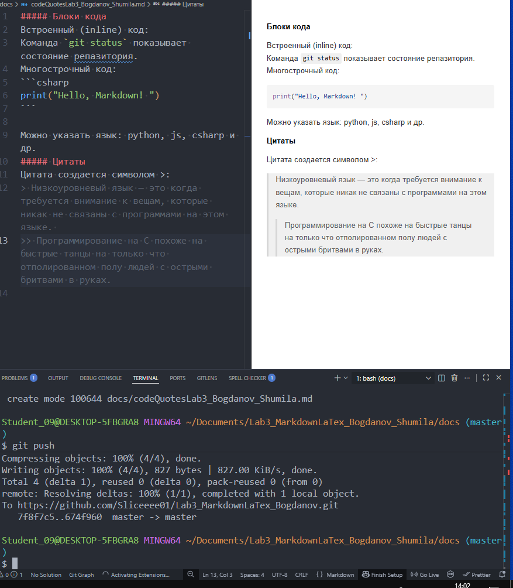

# Лабораторная работа №3
### **Описание работы:**  
Научится работать с Markdown и LaTex

### **Содержание** 

[ Заголовки и подзаголовки в Markdown](docs/headersLab3_Bogdanov_Shumila.md)
[Горизонтальные линии](docs/separatorsLab3_Bogdanov_Shumila.md)
[Текстовое форматирование](docs/formattingLab3_Bogdanov_Shumila.md)
[Списки в Markdown](docs/listsLab3_Bogdanov_Shumila.md)
[Ссылки изображения в Markdown](docs/linksImagesLab3.Bogdanov_Shumila.md)
[Блоки кода и цитаты](docs/codeQuotesLab3_Bogdanov_Shumila.md)
[Таблицы в Markdown](docs/tablesLab3_Bogdanov_Shumila.md)
[Дополнительные возможности Markdown](docs/advancedMarkdownLab3_Bogdanov_Shumila.md)
[LaTeX в Markdown](docs/latexLab3_Bogdanov_Shumila.md)

### Структура проекта
# Markdown
___
**Markdown** — это ~~сложный~~ лёгкий язык разметки, который используется для оформления
*README-файлов*, *документации*, *отчётов* и даже *научных текстов*. Он прост в использовании, хорошо читается как в сыром виде, так и после рендеринга, и широко поддерживается **GitHub**, **VS Code** и **многими платформами**.

**Списки**

**Маркированный**
* Git базовые команды
* Работа с ветками
* ~~Устаревший подход~~ **Современный workflow**

**Нумерованный**
1. Markdown синтаксис
2.  Форматирование текста
3. Создание таблиц и списков

**Вложенный**
1.  JavaScript синтаксис
      * Работа с DOM
      * Асинхронные операции

### Цитата
Цитата создается символом >:
> Низкоуровневый язык — это когда требуется внимание к вещам, которые никак не связаны с программами на этом языке. 
>> Программирование на С похоже на быстрые танцы на только что отполированном полу людей с острыми бритвами в руках.

### Блок кода
```csharp
Console.Writeline("Hello! ")
```
### Таблица
| Функция | Команда Git | Описание |
|----------|-----------|---|
| Создаение репазитория | **git init** |Инициализация репозитория |
|Просмотр состояния|**git status**|Показывает изменённые файлы|
|Отправка на GitHub|**git push**|Загружает коммиты на сервер|

### Изображение из папки img/


### Ссылка
[Внешняя](https://web.telegram.org/)
[Внутренняя](docs/linksImagesLab3.Bogdanov_Shumila.md)

### Чекбоксы
-[] **Изучить** продвинутые возможности Markdown
  -[x] *Практиковать* создание таблиц и списков

### Сноска
Markdown полезен в разработке[^1](https://skillbox.ru/media/code/chto-takoe-markdown-i-zachem-on-nuzhen-redaktory-dialekty-otlichiya-ot-html/?ysclid=mkl2x88lz8378003370)
[^Примечание](hhh)

### Alert-блоки GitHub
>[!NOTE]
**Совет по использованию:**
Структурировать текст с помощью **заголовков и списков**.
Избегать избыточного форматирования — *не злоупотреблять жирным и курсивным текстом*, минимизировать использование декоративных элементов.
>[!TIP]
**Совет по использованию:**
Структурировать текст с помощью **заголовков и списков**.
Избегать избыточного форматирования — *не злоупотреблять жирным и курсивным текстом*, минимизировать использование декоративных элементов.
>[!WARNING]
**Совет по использованию:**
Структурировать текст с помощью **заголовков и списков**.
Избегать избыточного форматирования — *не злоупотреблять жирным и курсивным текстом*, минимизировать использование декоративных элементов.

### Inline LaTeX
Пример:
$S = ½ (a + b) × h.$

###  Block LaTeX
Пример:
$$
\sum_{i=1}^n i = \frac{n(n+1)}{2}
$$
___